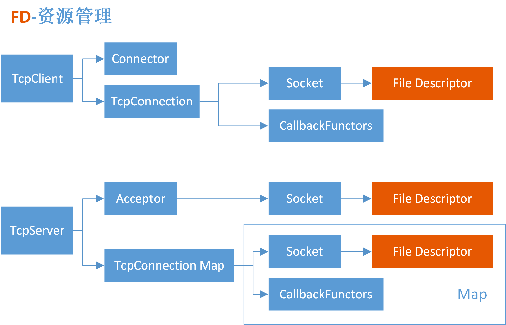
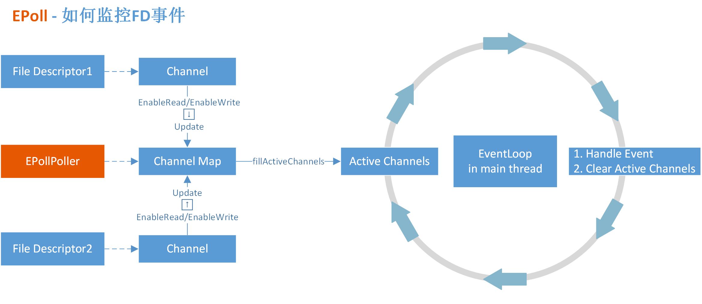
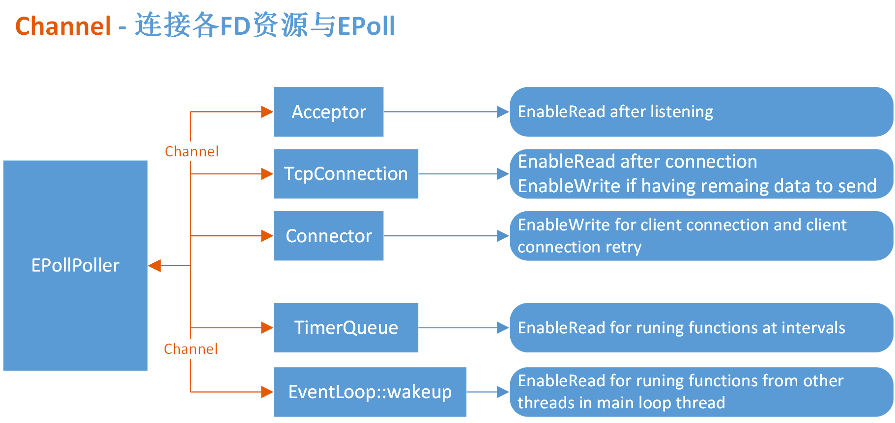

# Moduo Architecture
## File Descriptor - 资源管理

* TcpClient
    - 每个`TcpClient`拥有一个`TcpConnection`
        - `TcpConnection`拥有一个连接服务器的Socket资源
    - 每个`TcpClient`拥有一个`Connector`
        - `Connector`用于发起Client的连接（支持连接重试）
        - `Connector`会把打开的Socket资源交给`Client`的`TcpConnection`维护
* TcpServer
    - 每个`TcpServer`拥有**多个**`TcpConnection`
        - 每个`TcpConnection`拥有一个连接Client的Socket资源
        - 因为一个服务器可以接受多个Client的连接，所以需要多个`TcpConnection`
    - 每个`TcpServer`拥有一个`Acceptor`
        - `Acceptor`拥有一个Socket资源，用于监控Client的连接

## EPoll - 如何监控FD事件

* FD资源通过`Channel`和`EPollPoller`连接
* `EPollPoller`用一个`Map`维护着所有`Channel`
* 每当某个FD发生事件，其对应的`Channel`会变成`ActiveChannel`
* `EPollPoller`将`ActiveChannel`通知给`EventLoop`
* `EventLoop`执行`ActiveChannel`的事件`HandleEvent`
* `EventLoop`执行完`HandleEvent`后会清除`ActiveChannel`，继续循环等待`EPollPoller`的通知

## Channel - 如何连接各FD资源与EPoll

* `muduo`拥有五种类型的`Channel`实现不同的事件驱动
    - Acceptor Channel
    - TcpConnection Channel
    - Connector Channel
    - TimerQueue Channel
    - EventLoop::wakeup Channel
* Acceptor Channel
    - 连接着`Acceptor`的Socket资源
    - `EPollPoller`监控`Acceptor`的`Read`事件 
    如果有新的Client连接到来，`Acceptor`的Socket资源变为可读，触发`Acceptor::handleRead()`事件函数。
    - `Acceptor::handleRead()`事件函数会执行`TcpServer`的回调函数`newConnection`
* TcpConnection Channel
    - 连接着`TcpConnection`的Socket资源
    - `EPollPoller`监控着`TcpConnection`的`Read`事件 
    如果从此连接的另一端有数据`send`过来，此`TcpConnection`的Socket资源变为可读，触发`TcpConnection::handleRead`事件函数。
    - `TcpConnection::handleRead`事件函数 
    此事件函数会执行`TcpConnection`的回调函数`MessageCallback`，此回调函数需要用户在里面实现收到数据后的业务逻辑。
    - `EPollPoller`监控着`TcpConnection`的`Write`事件 
    如果一次`TcpConnection`的Socket`write`无法发送完所有的数据，Socket资源暂时会不可写，没发送完的数据被暂时存储在`outputBuffer_`中。此时`EPollPoller`会监控`TcpConnection`的`Write`事件。当连接另一端读走数据后，Socket资源重新变为可写，触发`TcpConnection::handleWrite`事件函数。 
    如果一次`send`可以发送完所有数据，`send`函数会立即执行回调函数`WriteCompleteCallback`。如果没有发完，回调函数`WriteCompleteCallback`会延后到`TcpConnection::handleWrite`事件函数中执行。
    - `TcpConnection::handleWrite`事件函数 
    此回调函数会执行回调函数`WriteCompleteCallback`，此回调函数需要用户在里面实现发送完数据后的业务逻辑。
* Connector Channel
    - 连接一个即将连接服务器的Socket资源
    - `EPollPoller`监控着`Connector`的`Write`事件 
    当此Socket资源变成可读的时候（即当前Client连接上服务器），触发`Connector::handleWrite`事件函数。
    - `Connector::handleWrite`事件函数 
    此事件函数会执行`TcpClient`的回调函数`newConnection`。
* TimerQueue Channel
    - 连接着一个内部的`timerfd`资源
    - `EPollPoller`监控着`TimerQueue`的`Read`事件函数 
    当用户调用`EventLoop::runEvery`实现按一定间隔时间执行某个函数，或者调用`EventLoop::runAfter`实现函数的延后执行时，会通过`TimerQueue::addTimer`往`timerfd`资源写入数据。此时`timerfd`资源变成可读，触发`TimerQueue::handleRead`事件函数。
    - `TimerQueue::handleRead`事件函数 
    此事件函数中会往`TimerList`中添加一个带`Timer`的回调函数，然后回调函数会按照`Timer`的行为实现延时调用或者间隔一定时间调用。
* EventLoop::wakeup Channel
    - 连接着一个内部的`eventfd`资源
    - `EPollPoller`监控着`EventLoop`的`Read`事件函数 
    当某子线程调用`EventLoop::queueInLoop`，希望在主线程中执行它的函数时。在`EventLoop::queueInLoop`中，子线程函数会被填入`pendingFunctors_`，同时`eventfd`资源会被写入某个数据，触发`EventLoop::handleRead()`事件函数。
    - 和其他事件触发不同，`EventLoop::handleRead()`事件函数里面并没有执行什么逻辑。此次触发最主要的作用时唤醒主线程，执行`EventLoop::loop`的一次循环。在循环的末尾，主线程会调用`doPendingFunctors`，执行`pendingFunctors_`里所有的回调函数。这样就达到了子线程函数在主线程执行的目的。

# 多线程编程示例
## Mutex
- [Counter](./code/Counter/Counter.cpp)
- [Observer](./code/Observer/main.cpp)

## Deadlock
- [SelfDeadLock](./code/SelfDeadLock/SelfDeadLock.cpp)
- [MutualDeadLock](./code/MutualDeadLock/MutualDeadLock.cpp)

## Server Model
- [echo-iterative](./code/ServerModel/01.echo-iterative(one-process-one-thread).py)
- [echo-single](./code/ServerModel/02.echo-single(one-process-one-thread).py)
- [echo-fork](./code/ServerModel/03.echo-fork(multi-process-one-thread).py)
- [echo-thread](./code/ServerModel/04.echo-thread(one-process-multi-thread).py)
- [tcpRelay](./code/ServerModel/05.tcpRelay(proxy).py)